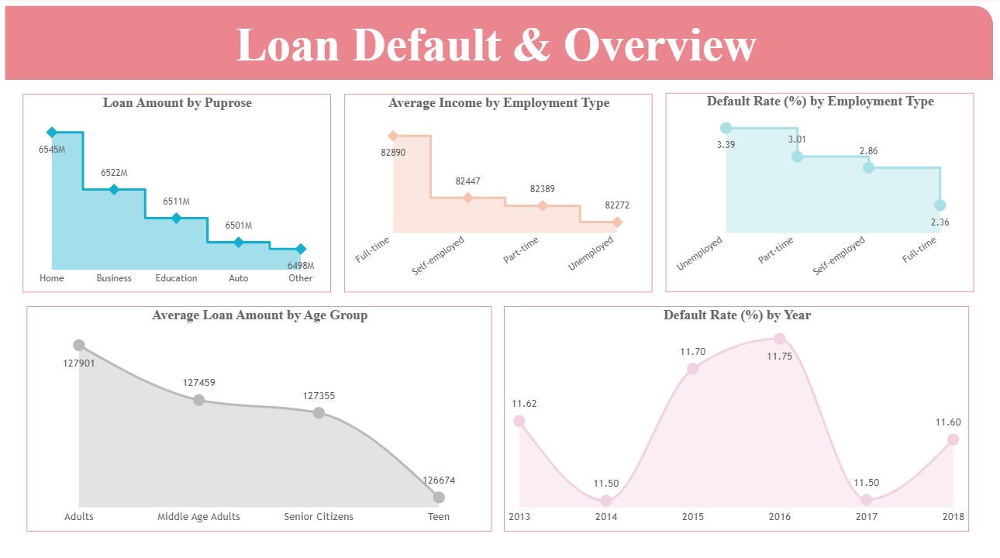

# 💡 Loan Default Risk Analysis (Power BI, SQL & Excel)

**End-to-end Loan Default Risk Assessment using SQL, Excel (DAX), and Power BI for data-driven financial insights.**

---

## 🚀 Project Overview

In this project, I analyzed borrower profiles and loan data to identify risk patterns and potential defaulters. The workflow converts raw loan data into actionable insights that enable financial institutions to make smarter, evidence-based lending decisions.

| 🎯 **Goal** | **Methodology** | 💰 **Impact** |
| :--- | :--- | :--- |
| Identify High-Risk Borrowers | Full Data Pipeline: SQL → Excel (DAX) → Power BI Reporting | Improved loan risk visibility & decision-making efficiency |

---

## 🛠️ Technology Stack & Skills

| Tool / Technology | Skill Highlight |
| :--- | :--- |
| **SQL** (`SQLQueryLoan.sql`) | **Data Cleaning, Transformation, and Loan Segmentation** 🗄️ |
| **Excel (DAX Formulas)** | **Financial KPIs & calculated risk measures** |
| **Power BI** (`Loan Risk and Applicant Analysis Template.pbit`) | **Interactive dashboards & DAX visualization modeling** 📊 |
| **GitHub** | **Version Control and documentation management** 📂 |

---

## 📈 Key Findings & Insights

* **Default Rate:** **14.8%** of total applicants defaulted on their loans 📉.
* **Demographic Risk:** Younger and low-income applicants showed higher default tendencies.
* **Financial Indicators:** High **Debt-to-Income** and **Loan-to-Value** ratios were major risk factors.
* **Business Outcome:** Helped financial teams prioritize high-risk profiles and improve approval accuracy.

---

## 🖼️ Dashboard Visuals

### 1. Loan Default Overview
*Summary dashboard highlighting total applicants, default rate, and loan categories.*

### 2. Applicant Demographics
*Distribution of loan applicants by age, income, and employment type.*

### 3. Financial Risk Metrics
*Visuals showcasing DTI, loan amount, and risk correlation metrics.*

---

## ⚙️ Repository Contents & How to Run

| File / Folder | Description |
| :--- | :--- |
| `Loan_default (Data).csv` | Dataset containing applicant and loan details |
| `SQLQueryLoan.sql` | SQL script for cleaning and preprocessing data |
| `DAX Formulas.xlsx` | Excel file containing DAX formulas and financial measures |
| `Loan Risk and Applicant Analysis Template.pbit` | Power BI dashboard template file |
| `Applicant Demographics.png`, etc. | Dashboard screenshots |

### How to Reproduce Results

1.  **SQL Data Cleaning:** Run the **`SQLQueryLoan.sql`** script on the **`Loan_default (Data).csv`** to prepare the data for reporting.
2.  **KPI Calculation in Excel:** Refer to **`DAX Formulas.xlsx`** for formulas used to compute financial ratios and performance metrics.
3.  **Visualization in Power BI:** Open **`Loan Risk and Applicant Analysis Template.pbit`** in Power BI Desktop and load the cleaned dataset to view dashboards.

### 🔮 Future Improvements

* Integrate a predictive **ML model** to forecast loan default probability.
* Test the model against other classification algorithms like Logistic Regression.
* Build a dynamic Credit Scoring dashboard for quick applicant risk evaluation.
